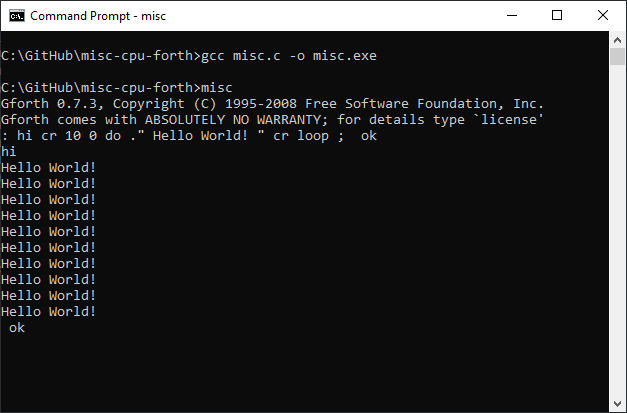

# misc-cpu-forth
Fairweather 'C' implementation of a MISC (Minimal Instruction Set CPU) virtual machine with a GForth kernel.

## File List
A description of the files included in this repository.  
**readme.md**  - This file  
**misc.c**     - Source code
**kernel.bin** - GForth 

## Build instructions
This program is unlikely to run or compile on a non-Windows machine. It can be built with the GCC compiler as follows:
```

gcc misc.c -o misc.exe

```
Running **misc.exe** will load and run the GForth kernel.

## Screenshot


## TODO
* Documentation
* VHDL version for a FPGA platform
* Instructions on how to build the GForth kernel
* Add comments and improve user friendliness

## Licence
MIT License - refer to the license file included with this repository.
